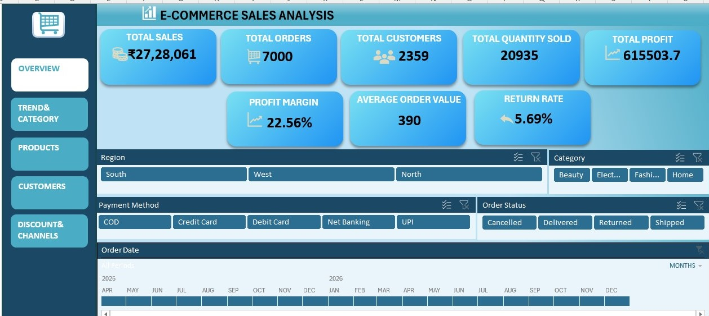
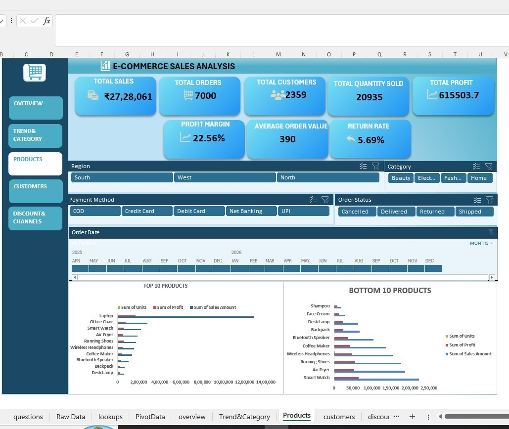
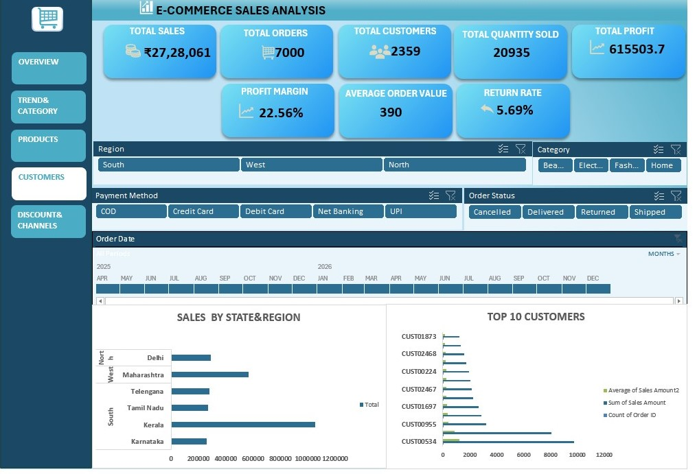

# E-Commerce Sales Analytics Dashboard

## 📊 Project Overview

Build an interactive **E-Commerce Sales & Customer Analytics Dashboard** using Microsoft Excel 2024 that allows management to monitor:

- Sales Performance
- Customer Behavior
- Product Performance
- Regional Performance
- Discounts
- Profitability
- Order Trends

The dashboard helps an e-commerce company identify:

- Best-selling products
- High-value customers
- Profitable categories
- Poor-performing regions
- Monthly sales trends
- Discount impact
- Return and cancellation patterns

## 📑 Dashboard Pages

### 1. Overview

Provides an overall summary of business performance, including:

- Total Sales
- Total Orders
- Total Customers
- Total Quantity Sold
- Total Profit
- Profit Margin
- Average Order Value
- Return Rate
- Regional Performance
- Category Performance
- Payment Method
- Order Status

### 2. Trend & Category

Analyzes:

- Monthly Sales Trends
- Monthly Profit
- Sales Growth %
- Category Sales
- Category Profit
- Order Trends

### 3. Products

Analyzes:

- Top 10 Products
- Bottom 10 Products
- Product Sales
- Product Profit
- Units Sold

### 4. Customers

Analyzes:

- Top 10 Customers
- Customer Sales
- Number of Orders
- Average Order Value
- High-Value Customers

### 5. Discount & Channels

Analyzes:

- Discount Impact
- Sales Channel Performance
- Payment Method Performance
- Sales
- Profit Margin
- Order Performance

## 🎛️ Interactive Features

- Interactive Slicers
- Timeline
- Region Filter
- Category Filter
- Payment Method Filter
- Order Status Filter
- Dashboard Navigation

## 📌 Key KPIs

| KPI | Value |
|---|---:|
| Total Sales | ₹27,28,061 |
| Total Orders | 7,000 |
| Total Customers | 2,359 |
| Total Quantity Sold | 20,935 |
| Total Profit | ₹6,15,503.70 |
| Profit Margin | 22.56% |
| Average Order Value | 390 |
| Return Rate | 5.69% |

## 🛠️ Tools Used

- Microsoft Excel 2024
- PivotTables
- PivotCharts
- Slicers
- Timeline
- Excel Formulas
- Dashboard Design

## 📷 Dashboard Preview

### Overview

### Trend & Category

### Products

### Customers

### Discount & Channels

## 📁 Project Files

- `project1.xlsx` – Excel dashboard
- `README.md` – Project documentation
- Dashboard screenshots

## 🎯 Project Objective

The dashboard is designed to support management in making data-driven decisions by providing a clear view of sales, customers, products, regions, discounts, profitability, and order performance.
